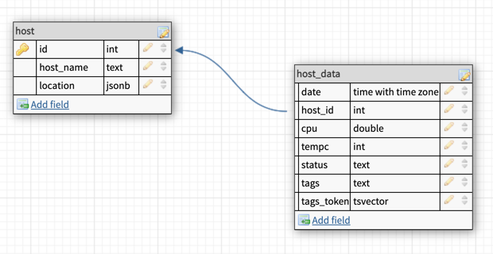

# Сбор и использование статистики

## Подготовка

Перед началом создадим таблицы для экспериментов. Заполнение таблиц будем производить при помощи несколько
видоизмененных скриптов:


- Чтобы сгенерировать колонку в одной из таблиц с текстом, скопируем в контейнер с PostgreSQL файл со словами:

```shell
> docker cp /usr/share/dict/web2 some-postgres:/var/lib/postgresql/data/words
```

- Далее, непосредственно в контейнере создадим базу данных `json_and_index` в которой и будем производит опыты:

```sql
CREATE DATABASE json_and_index;
\c json_and_index
```

- Для генерации данных нам понадобяться несколько функций:
    - для генерации случайных чисел `random_between`;
    - для генерации последовательности слов из словаря скопированного выше `random_tags`;
    - для генерации случайной последовательности чисел и символов `random_text`;
    - для генерации JSON'ов `random_json`;

<pre>
<details>
<summary>Функция `random_between`</summary>
```sql
CREATE OR REPLACE FUNCTION random_between(min_val NUMERIC, max_val NUMERIC, round_to INT = 0)
RETURNS NUMERIC AS
$$
    DECLARE
        value NUMERIC = random() * (min_val - max_val) + max_val;
    BEGIN
        IF round_to = 0 THEN
            RETURN floor(value);
        ELSE
            RETURN round(value, round_to);
        END IF;
    END
$$ language 'plpgsql';
```
</details>
</pre>
<pre>
<details>
<summary>Функция `random_tags`</summary>
```sql 
CREATE OR REPLACE FUNCTION random_tags(min_val NUMERIC = 0, max_val NUMERIC = 10) 
RETURNS TEXT AS
$$
    DECLARE
        words TEXT[] = string_to_array(pg_read_file('words')::text, E'\n');
        random_val NUMERIC = floor(random() * (max_val - min_val) + min_val)::INTEGER;
        max_words_length NUMERIC = array_length(words, 1);
        result TEXT = '';
    BEGIN
        SELECT * INTO result FROM (
            SELECT string_agg(words[random() * (max_words_length - 1) + 1], ' ') FROM generate_series(1, random_val)
        ) AS a;
        RETURN result;
    END
$$ LANGUAGE 'plpgsql';
```
</details>
</pre>
<pre>
<details>
<summary>Функция `random_text`</summary>
```sql 
CREATE OR REPLACE FUNCTION random_text(min_val INT = 5, max_val INT = 50)
RETURNS text AS
$$
    DECLARE
        word_length NUMERIC  = floor(random() * (max_val - min_val) + min_val)::INTEGER;
        random_word TEXT = '';
    BEGIN
        -- only if the word length we get has a remainder after being divided by 5. This gives
        -- some randomness to when words are produced or not. Adjust for your tastes.
        IF (word_length % 5) > 1 THEN
            SELECT * INTO random_word FROM (
                WITH symbols(characters) AS (VALUES ('ABCDEFGHIJKLMNOPQRSTUVWXYZ abcdefghijklmnopqrstuvwxyz 0123456789 '))
                SELECT string_agg(substr(characters, (random() * length(characters) + 1) :: INTEGER, 1), ''), 'g1' AS idx
                    FROM symbols
                    JOIN generate_series(1, word_length) AS word(chr_idx) ON 1 = 1 -- word length
                GROUP BY idx
            ) AS a;
        END IF;
        RETURN random_word;
    END
$$ LANGUAGE 'plpgsql';
</details>
</pre>
<pre>
<details>
<summary>Функция `random_json`</summary>
```
### `random_json`
```sql
CREATE OR REPLACE FUNCTION random_json(keys TEXT[] = '{"a","b","c"}', min_val NUMERIC = 0, max_val NUMERIC = 10)
RETURNS JSON AS
$$
    DECLARE
        random_val NUMERIC = floor(random() * (max_val - min_val) + min_val)::INTEGER;
        random_json JSON = NULL;
    BEGIN
        -- again, this adds some randomness into the results. Remove or modify if this
        -- isn't useful for your situation
        IF (random_val % 5) > 1 THEN
            SELECT * INTO random_json FROM (
                SELECT json_object_agg(key, random_between(min_val,max_val)) AS json_data
                FROM unnest(keys) AS u(key)
            ) AS json_val;
        END IF;
        RETURN random_json;
    END
$$ LANGUAGE 'plpgsql';
```
</details>
</pre>

### Структура Таблиц



- Создадим две таблицы со следующей структурой:

```sql
CREATE TABLE host (
	id INT PRIMARY KEY,
	host_name TEXT,
	LOCATION JSONB
);
CREATE TABLE host_data (
	date TIMESTAMPTZ NOT NULL,
	host_id INT NOT NULL,
	cpu DOUBLE PRECISION,
	tempc INT,
	status TEXT,
	tags TEXT,
	tags_token TSVECTOR
);
```

- Далее заполним таблицы при помощи наших функций данными:

<pre>
<details>
<summary>Запос заполняющий таблицу `host`</summary>
```sql
INSERT INTO host
SELECT 
    id, 
    'host_' || id::TEXT AS name, 
	random_json(ARRAY['building', 'rack'], 1, 20) AS location
FROM generate_series(1, 100) AS id;
```
</details>
</pre>
<pre>
<details>
<summary>Запос заполняющий таблицу `host_data`</summary>
```sql
INSERT INTO host_data
SELECT 
    date, 
    host_id,
	random_between(5, 100, 3) AS cpu,
	random_between(28, 90) AS tempc,
	random_text(20, 75) AS status, 
	random_tags(3,5) AS tags
FROM 
    generate_series(now() - INTERVAL '1 MONTH', now(), INTERVAL '10 minutes') AS date,
    generate_series(1, 10) AS host_id;
```
</details>
</pre>

- Одну строку добавим отдельно она понадобиться нам для демонстрации JOIN'ов:

```sql
INSERT INTO host_data VALUES('2021-09-11 20:50:39', 101, 78.529, 65, 'oYotMF jM', 'ratter poster', to_tsvector('ratter poster'));
```

- Также преобразуем содержимое колонки `host_data.tags` в лексемы и скопируем результат в
  колонку `host_data.tags_token`:

```sql
UPDATE host_data SET tags_token = to_tsvector(tags);  
```

Пример содержимого таблицы `host`:

```shell
json_and_index=# SELECT * FROM host LIMIT 10;
 id | host_name |           location
----+-----------+------------------------------
  1 | host_1    |
  2 | host_2    | {"rack": 3, "building": 4}
  3 | host_3    |
  4 | host_4    | {"rack": 6, "building": 8}
  5 | host_5    | {"rack": 17, "building": 12}
  6 | host_6    | {"rack": 5, "building": 17}
  7 | host_7    | {"rack": 10, "building": 2}
  8 | host_8    | {"rack": 18, "building": 4}
  9 | host_9    | {"rack": 17, "building": 10}
 10 | host_10   |
```

Пример содержимого таблицы `host_data`:

```shell
json_and_index=# SELECT * FROM host_data LIMIT 3 \gx
-[ RECORD 1 ]-----------------------------------------------------
date       | 2021-09-11 20:50:39.908605+00
host_id    | 1
cpu        | 65.429
tempc      | 66
status     | Cs7oYotMF jM v 0PLPd1OH
tags       | hermit prefragrant companator
tags_token | 'compan':3 'hermit':1 'prefragr':2
-[ RECORD 2 ]-----------------------------------------------------
date       | 2021-09-11 21:00:39.908605+00
host_id    | 1
cpu        | 66.272
tempc      | 87
status     | Uyy kXi1C3MXXxFbezlyXPySdL4q  P5rUrrocLylns21geMO GFu
tags       | unbeholden Euahlayi humanitarianize
tags_token | 'euahlayi':2 'humanitarian':3 'unbeholden':1
-[ RECORD 3 ]-----------------------------------------------------
date       | 2021-09-11 21:10:39.908605+00
host_id    | 1
cpu        | 40.151
tempc      | 69
status     |
tags       | pseudomeningitis vulpine terricoline
tags_token | 'pseudomening':1 'terricolin':3 'vulpin':2
```

Посмотрим получившиейся размер таблиц и колличество строк:

```shell
json_and_index=# SELECT COUNT(*) FROM host;
count
-------
100

json_and_index=# SELECT COUNT(*) FROM host_data;
count
---------
1310500

json_and_index=# select pg_size_pretty(pg_table_size('host'));
 pg_size_pretty
----------------
 16 kB
 
json_and_index=# select pg_size_pretty(pg_table_size('host_data'));
 pg_size_pretty
----------------
 398 MB
```

## Индексы

### 1. Создать индекс к какой-либо из таблиц вашей БД

Для начала выполним простой запрос и найдем сервера где температура была меньше 50 градусов (выберем все колонки и
только `tempc`):
<pre>
<details>
<summary><code>EXPLAIN ANALYZE</code> для запроса по температуре без индекса</summary>
```shell
json_and_index=# EXPLAIN ANALYZE SELECT * FROM host_data WHERE tempc < 50;
                                                 QUERY PLAN
---------------------------------------------------------------------------------------------------------------------
Seq Scan on host_data  (cost=0.00..67240.80 rows=457455 width=152) (actual time=2.001..450.509 rows=465121 loops=1)
Filter: (tempc < 50)
Rows Removed by Filter: 845379
Planning Time: 3.692 ms
Execution Time: 467.737 ms
 
json_and_index=# EXPLAIN ANALYZE SELECT tempc FROM host_data WHERE tempc < 50;
                                                QUERY PLAN
-------------------------------------------------------------------------------------------------------------------
Seq Scan on host_data  (cost=0.00..67240.80 rows=457455 width=4) (actual time=0.457..233.898 rows=465121 loops=1)
Filter: (tempc < 50)
Rows Removed by Filter: 845379
Planning Time: 1.616 ms
Execution Time: 252.805 ms
```
</details>
</pre>

**Результат**: `Seq Scan on host_data` в обоих случаях, выбрано - 465121 строк за 467 миллисекунд для всех колонок и 252
для
`tempc`

Создадим индекс и воспользуемся правилами именования по ссылке ниже:

* [The standard names for indexes in PostgreSQL](https://gist.github.com/popravich/d6816ef1653329fb1745)

```sql
CREATE INDEX host_data_tempc_idx ON host_data (tempc);
ANALYZE host_data;
```

Посмотрим размер индекса:
```shell
json_and_index=# SELECT pg_size_pretty(pg_table_size('host_data_tempc_idx'));
 pg_size_pretty
----------------
 8920 kB
```

Выполним теже самые запросы и проверим, был ли использован индекс:
<pre>
<details>
<summary><code>EXPLAIN ANALYZE</code> для запроса по температуре c индексом</summary>
```shell
json_and_index=# EXPLAIN ANALYZE SELECT * FROM host_data WHERE tempc < 50;
QUERY PLAN
-------------------------------------------------------------------------------------------------------------------------------------------
Bitmap Heap Scan on host_data  (cost=5130.40..61761.53 rows=459610 width=151) (actual time=65.952..479.327 rows=465121 loops=1)
Recheck Cond: (tempc < 50)
Heap Blocks: exact=30558
->  Bitmap Index Scan on host_data_tempc_idx  (cost=0.00..5015.50 rows=459610 width=0) (actual time=61.814..61.814 rows=465121 loops=1)
Index Cond: (tempc < 50)
Planning Time: 1.275 ms
Execution Time: 495.436 ms

json_and_index=# EXPLAIN ANALYZE SELECT tempc FROM host_data WHERE tempc < 50;
QUERY PLAN
--------------------------------------------------------------------------------------------------------------------------------------------------
Index Only Scan using host_data_tempc_idx on host_data  (cost=0.43..9611.60 rows=459610 width=4) (actual time=0.448..57.303 rows=465121 loops=1)
Index Cond: (tempc < 50)
Heap Fetches: 0
Planning Time: 0.354 ms
Execution Time: 87.629 ms
```
</details>
</pre>

**Результат**: `Bitmap Index Scan on host_data_tempc_idx` Bitmap отменил нужные страницы с данными используя индекс в
первом случае и `Index Only Scan` использовался только индекс во втором. Времы выполнения запроса в первом случае даже
замедлилолсь (495 стало, было 467), но во втором значительно выросло (87 стало, было 252).

### 2. Реализовать индекс для полнотекстового поиска

Для демонстрации работы полнотекстового поиска попробуем найти все строки где содержится подстрока `dog` в
колонке `tags_token`:

> Полнотекстовый поиск в Postgres реализован на базе оператора соответствия `@@`, который возвращает `true`, если `tsvector`
> (документ) соответствует `tsquery` (запросу).

<pre>
<details>
<summary><code>EXPLAIN ANALYZE</code> для запроса по поиску подстроки <code>dog</code> в колонке <code>tags_token</code></summary>
```shell
json_and_index=# EXPLAIN ANALYZE SELECT * FROM host_data WHERE tags_token @@ to_tsquery('dog');
                                                          QUERY PLAN
------------------------------------------------------------------------------------------------------------------------------
 Gather  (cost=1000.00..195363.13 rows=153 width=151) (actual time=68.269..596.898 rows=95 loops=1)
   Workers Planned: 2
   Workers Launched: 2
   ->  Parallel Seq Scan on host_data  (cost=0.00..194347.83 rows=64 width=151) (actual time=31.138..522.293 rows=32 loops=3)
         Filter: (tags_token @@ to_tsquery('dog'::text))
         Rows Removed by Filter: 436802
 Planning Time: 2.803 ms
 JIT:
   Functions: 6
   Options: Inlining false, Optimization false, Expressions true, Deforming true
   Timing: Generation 8.833 ms, Inlining 0.000 ms, Optimization 4.768 ms, Emission 27.631 ms, Total 41.231 ms
 Execution Time: 604.732 ms
```
</details>
</pre>

**Результат**: `Parallel Seq Scan on host_data` - хоть и параллельный но последовательный поиск по таблице `host_data`,
выбрано - 95 строк за 604 миллисекунды

> Более предпочтительными для текстового поиска являются индексы GIN. Будучи инвертированными индексами, они содержат 
> записи для всех отдельных слов (лексем) с компактным списком мест их вхождений. При поиске нескольких слов можно найти
> первое, а затем воспользоваться индексом и исключить строки, в которых дополнительные слова отсутствуют. Индексы GIN 
> хранят только слова (лексемы) из значений tsvector, и теряют информацию об их весах. Таким образом для выполнения 
> запроса с весами потребуется перепроверить строки в таблице.

Создадим `GIN` индекс для колонки `tags_token`:
```sql
CREATE INDEX host_data_tags_token_idx ON host_data USING GIN (tags_token);
ANALYZE host_data;
```

Посмотрим размер индекса (он получиться довольно объемным):
```shell
json_and_index=# SELECT pg_size_pretty(pg_table_size('host_data_tags_token_idx'));
 pg_size_pretty
----------------
 40 MB
```
Выполним тот же запрос и проверим, был ли использован индекс:
<pre>
<details>
<summary><code>EXPLAIN ANALYZE</code> для запроса по поиску подстроки <code>dog</code> в колонке <code>tags_token</code> c использование индекса</summary>
```shell
json_and_index=# EXPLAIN ANALYZE SELECT * FROM host_data WHERE tags_token @@ to_tsquery('dog');
                                                             QUERY PLAN
-------------------------------------------------------------------------------------------------------------------------------------
 Bitmap Heap Scan on host_data  (cost=21.44..648.43 rows=153 width=151) (actual time=0.656..4.267 rows=95 loops=1)
   Recheck Cond: (tags_token @@ to_tsquery('dog'::text))
   Heap Blocks: exact=95
   ->  Bitmap Index Scan on host_data_tags_token_idx  (cost=0.00..21.40 rows=153 width=0) (actual time=0.530..0.531 rows=95 loops=1)
         Index Cond: (tags_token @@ to_tsquery('dog'::text))
 Planning Time: 5.027 ms
 Execution Time: 4.440 ms
```
</details>
</pre>

**Результат**: `Bitmap Index Scan on host_data_tags_token_idx` индекс был успешно использован,
выбрано - 95 строк за 4 миллисекунды, что в 15 раз быстрее запроса без индекса.

### 3. Реализовать индекс на часть таблицы или индекс на поле с функцией

#### 3.1. На часть таблицы

Для демонстрации работы [Частичных индексыов](https://postgrespro.ru/docs/postgresql/14/indexes-partial) вообразим 
ситуацию в которой нам необходимо найти все записи, в которых нагрузка на процессор была менее 25.5 процентов или же 
больше 75.5: 

<pre>
<details>
<summary><code>EXPLAIN ANALYZE</code> для запроса по поиску всех строк у которых <code>cpu</code> менее 25.5 или более 75.5</summary>
```shell
EXPLAIN ANALYZE SELECT * FROM host_data WHERE cpu < 25.5 OR cpu > 75.5;
                                                     QUERY PLAN
---------------------------------------------------------------------------------------------------------------------
 Seq Scan on host_data  (cost=0.00..70586.28 rows=548964 width=151) (actual time=1.061..289.688 rows=620881 loops=1)
   Filter: ((cpu < '25.5'::double precision) OR (cpu > '75.5'::double precision))
   Rows Removed by Filter: 689619
 Planning Time: 2.024 ms
 Execution Time: 313.646 ms
```
</details>
</pre>

**Результат**: `Seq Scan on host_data`, который предваряет фильтрация по нашему условию, выбрано - 620881 строк за 331 миллисекунду.

Создадим частичные индекс (`WHERE (cpu < 25.5 OR cpu > 75.5)`) для колонки `cpu`:
```sql
CREATE INDEX host_data_cpu_idx ON host_data (cpu) WHERE (cpu < 25.5 OR cpu > 75.5);
ANALYZE host_data;
```

Посмотрим размер частичного индекса:
```shell
json_and_index=# SELECT pg_size_pretty(pg_table_size('host_data_cpu_idx'));
 pg_size_pretty
----------------
 13 MB
```
Основное отличие частичного индекса от обычного (по всем значениям), это его размер полный индекс занял бы места больше, чем в два раза:
```shell
json_and_index=# CREATE INDEX host_data_cpu_full_idx ON host_data (cpu);
CREATE INDEX
json_and_index=# SELECT pg_size_pretty(pg_table_size('host_data_cpu_full_idx'));
 pg_size_pretty
----------------
 28 MB
```
Выполним тот же запрос и проверим, был ли использован индекс:
<pre>
<details>
<summary><code>EXPLAIN ANALYZE</code> для запроса по поиску всех строк у которых <code>cpu</code> менее 25.5 или более 75.5 c частичным индексом</summary>
```shell
json_and_index=# EXPLAIN ANALYZE SELECT * FROM host_data WHERE cpu < 25.5 OR cpu > 75.5;
                                                               QUERY PLAN
-----------------------------------------------------------------------------------------------------------------------------------------
 Bitmap Heap Scan on host_data  (cost=8924.95..68098.17 rows=552481 width=152) (actual time=67.716..224.929 rows=620881 loops=1)
   Recheck Cond: ((cpu < '25.5'::double precision) OR (cpu > '75.5'::double precision))
   Heap Blocks: exact=30559
   ->  Bitmap Index Scan on host_data_cpu_idx  (cost=0.00..8786.83 rows=552481 width=0) (actual time=62.745..62.746 rows=620881 loops=1)
 Planning Time: 0.305 ms
 Execution Time: 245.712 ms
```
</details>
</pre>

**Результат**: `Bitmap Index Scan on host_data_cpu_idx` - индекс был использован, выбрано - 620881 строк за 245 
миллисекунду, что ощутимо быстрее предыдущего запроса.

Также проверим, что если диапазон значений используемый для фильтрации больше левой границы `> 25.5` или/и меньше правой 
`75.5`, то в таком случае индекс использован не будет:
<pre>
<details>
<summary><code>EXPLAIN ANALYZE</code> для запросов вне границы частичного индекса</summary>
```shell
json_and_index=# EXPLAIN ANALYZE SELECT * FROM host_data WHERE cpu > 50.5;
---------------------------------------------------------------------------------------------------------------------
 Seq Scan on host_data  (cost=0.00..67192.04 rows=682014 width=151) (actual time=0.452..259.390 rows=682599 loops=1)
   Filter: (cpu > '50.5'::double precision)
   Rows Removed by Filter: 627901
   
json_and_index=# EXPLAIN ANALYZE SELECT * FROM host_data WHERE cpu < 40.5;
---------------------------------------------------------------------------------------------------------------------
 Seq Scan on host_data  (cost=0.00..67192.04 rows=483451 width=151) (actual time=0.335..169.322 rows=489613 loops=1)
   Filter: (cpu < '40.5'::double precision)
   Rows Removed by Filter: 820887
```
</details>
</pre>

И наоборот если хотя условия для фильтрации находится в пределах индекса, то он (индекс) будет успешно использован:
<pre>
<details>
<summary><code>EXPLAIN ANALYZE</code> для запросов попадающего в границы частичного индекса</summary>
```shell
json_and_index=# EXPLAIN ANALYZE SELECT * FROM host_data WHERE cpu > 80.5;
-----------------------------------------------------------------------------------------------------------------------------------------
 Bitmap Heap Scan on host_data  (cost=5038.25..59256.22 rows=266558 width=151) (actual time=61.476..362.606 rows=269558 loops=1)
   Recheck Cond: (cpu > '80.5'::double precision)
   Heap Blocks: exact=30555
   ->  Bitmap Index Scan on host_data_cpu_idx  (cost=0.00..4971.61 rows=266558 width=0) (actual time=55.948..55.948 rows=269558 loops=1)
         Index Cond: (cpu > '80.5'::double precision)

json_and_index=# EXPLAIN ANALYZE SELECT * FROM host_data WHERE cpu < 20;
-----------------------------------------------------------------------------------------------------------------------------------------
 Bitmap Heap Scan on host_data  (cost=3897.56..57359.59 rows=206082 width=151) (actual time=45.707..194.778 rows=207141 loops=1)
   Recheck Cond: (cpu < '20'::double precision)
   Heap Blocks: exact=30533
   ->  Bitmap Index Scan on host_data_cpu_idx  (cost=0.00..3846.04 rows=206082 width=0) (actual time=39.212..39.212 rows=207141 loops=1)
         Index Cond: (cpu < '20'::double precision)
```
</details>
</pre>

#### 3.2. На поле с функцией

Для проверки работы индекса по выражениям, представим, что мы хотим найти все слова в строке которая находиться в 
колонке `status` у которых первые три символа начинаются на 'pre', 'cup' или 'les' (независимо от регистра букв):
<pre>
<details>
<summary><code>EXPLAIN ANALYZE</code> для запроса по поиску слов которые начинаются с 'pre', 'cup' или 'les' в колонке <code>status</code></summary>
```shell
json_and_index=# EXPLAIN ANALYZE SELECT * FROM host_data WHERE lower(substring(split_part(status, ' ', 2) for 3)) IN ('pre', 'cup', 'les');
                                                          QUERY PLAN
-------------------------------------------------------------------------------------------------------------------------------
 Gather  (cost=1000.00..65392.81 rows=19567 width=151) (actual time=89.341..262.726 rows=58 loops=1)
   Workers Planned: 2
   Workers Launched: 2
   ->  Parallel Seq Scan on host_data  (cost=0.00..62436.11 rows=8153 width=151) (actual time=30.849..199.907 rows=19 loops=3)
         Filter: (lower(SUBSTRING(split_part(status, ' '::text, 2) FROM 1 FOR 3)) = ANY ('{pre,cup,les}'::text[]))
         Rows Removed by Filter: 436814
 Planning Time: 0.886 ms
 Execution Time: 262.880 ms
```
</details>
</pre>

**Результат**: `Parallel Seq Scan on host_data` параллельный поиск, всего выбрано - 58 строк за 262 миллисекунду, что 
ощутимо быстрее предыдущего запроса.

Создадим индекс, используя те функции, которые мы использовали в запросе:
```sql
CREATE INDEX host_data_status_idx ON host_data (lower(substring(split_part(status, ' ', 2) for 3)));
ANALYZE host_data;
```

Выполним пару запросов с разным набором строк, чтобы убедиться, что индекс работает:
<pre>
<details>
<summary><code>EXPLAIN ANALYZE</code> для запроса по поиску слов в колонке <code>status</code> с индексом</summary>
```shell
json_and_index=# EXPLAIN ANALYZE SELECT * FROM host_data WHERE lower(substring(split_part(status, ' ', 2) for 3)) IN ('pre', 'cup', 'les');
                                                              QUERY PLAN
---------------------------------------------------------------------------------------------------------------------------------------
 Index Scan using host_data_status_idx on host_data  (cost=0.43..407.24 rows=105 width=152) (actual time=0.883..5.293 rows=58 loops=1)
   Index Cond: (lower(SUBSTRING(split_part(status, ' '::text, 2) FROM 1 FOR 3)) = ANY ('{pre,cup,les}'::text[]))
 Planning Time: 9.253 ms
 Execution Time: 5.490 ms
 
 json_and_index=# EXPLAIN ANALYZE SELECT * FROM host_data WHERE lower(substring(split_part(status, ' ', 2) for 3)) IN ('com', 'net', 'pic');
                                                              QUERY PLAN
---------------------------------------------------------------------------------------------------------------------------------------
 Index Scan using host_data_status_idx on host_data  (cost=0.43..407.24 rows=105 width=152) (actual time=1.084..4.844 rows=52 loops=1)
   Index Cond: (lower(SUBSTRING(split_part(status, ' '::text, 2) FROM 1 FOR 3)) = ANY ('{com,net,pic}'::text[]))
 Planning Time: 0.257 ms
 Execution Time: 4.910 ms
```
</details>
</pre>

**Результат**: `Index Scan using host_data_status_idx on host_data` - индекс был использован, выбрано - 58 (52 для 
второго запроса) строк за 5 (и 4 для второго запроса) миллисекунды, что практически на пару парядков быстрее запросов 
без индекса.

### 4. Создать индекс на несколько полей

Для демонстрации составных индексов представим, что мы хотим найти все записи за период между 15 ноября и 15 декабря, 
когда нагрузка на процессор превышала 75%:
<pre>
<details>
<summary><code>EXPLAIN ANALYZE</code> для запросов по диапазону дат <code>date</code> и <code>cpu</code></summary>
```shell
json_and_index=# EXPLAIN ANALYZE SELECT * FROM host_data WHERE (date BETWEEN '2021-10-15' AND '2021-11-15') AND (cpu > 75); 
                                                                                  QUERY PLAN
------------------------------------------------------------------------------------------------------------------------------------------------------------------------------
 Seq Scan on host_data  (cost=0.00..73703.79 rows=117242 width=152) (actual time=2.718..274.229 rows=117697 loops=1)
   Filter: ((date >= '2021-10-15 00:00:00+00'::timestamp with time zone) AND (date <= '2021-11-15 00:00:00+00'::timestamp with time zone) AND (cpu > '75'::double precision))
   Rows Removed by Filter: 1192803
 Planning Time: 0.473 ms
 Execution Time: 279.629 ms
```
</details>
</pre>

**Результат**: `Seq Scan on host_data` ничего необычного - последовательное сканирование, выбрано - 117697 строк за 279
миллисекунд.

Создадим составной индекс для колонок `cpu` и `date`:
```sql
CREATE INDEX host_data_date_and_cpu_idx ON host_data (date, cpu);
ANALYZE host_data;
```

И проверим, как будет работать наш запрос при наличии такого индекса:
<pre>
<details>
<summary><code>EXPLAIN ANALYZE</code> для запросов по диапазону дат <code>date</code> и <code>cpu</code> с составным индексом</summary>
```shell
json_and_index=# EXPLAIN ANALYZE SELECT * FROM host_data WHERE (date BETWEEN '2021-10-15' AND '2021-11-15') AND (cpu > 75);
                                                                                       QUERY PLAN
----------------------------------------------------------------------------------------------------------------------------------------------------------------------------------------
 Bitmap Heap Scan on host_data  (cost=12451.07..65380.58 rows=116772 width=152) (actual time=68.505..164.002 rows=117697 loops=1)
   Recheck Cond: ((date >= '2021-10-15 00:00:00+00'::timestamp with time zone) AND (date <= '2021-11-15 00:00:00+00'::timestamp with time zone) AND (cpu > '75'::double precision)
   Heap Blocks: exact=10549
   ->  Bitmap Index Scan on host_data_date_and_cpu_idx  (cost=0.00..12421.88 rows=116772 width=0) (actual time=67.281..67.282 rows=117697 loops=1)
         Index Cond: ((date >= '2021-10-15 00:00:00+00'::timestamp with time zone) AND (date <= '2021-11-15 00:00:00+00'::timestamp with time zone) AND (cpu > '75'::double precision))
 Planning Time: 3.530 ms
 Execution Time: 168.466 ms
```
</details>
</pre>

**Результат**: `Bitmap Index Scan on host_data_date_and_cpu_idx` индекс был использован, те же - 117697 строк, но уже за
168 миллисекунд.

:warning: Использование индекса не зависит от порядка следования колонок и будет применяться на запросы только по одной 
колонке `date` (но не будет использоваться только при условии на `cpu`).

## Соединения

### 1. Реализовать прямое соединение двух таблиц

Попробуем найти пересечение (`INNER JOIN`) двух таблиц `host` и `host_data` по ключу `id` и `host_id` соответственно, чтобы уменьшить 
количество строк, добавим в соединение условие на наличие в `host_data.tags_token` слов "cat" или "rat":
<pre>
<details>
<summary><code>EXPLAIN ANALYZE</code> для <code>INNER JOIN</code></summary>
```sql
json_and_index=# EXPLAIN ANALYZE SELECT h.id, hd.tags FROM host h JOIN host_data hd ON h.id = hd.host_id AND hd.tags_token @@ to_tsquery('cat | rat');
                                                                QUERY PLAN
-------------------------------------------------------------------------------------------------------------------------------------------
 Hash Join  (cost=41.85..1267.99 rows=304 width=41) (actual time=0.330..1.014 rows=91 loops=1)
   Hash Cond: (hd.host_id = h.id)
   ->  Bitmap Heap Scan on host_data hd  (cost=38.60..1263.91 rows=304 width=41) (actual time=0.199..0.810 rows=91 loops=1)
         Recheck Cond: (tags_token @@ to_tsquery('cat | rat'::text))
         Heap Blocks: exact=91
         ->  Bitmap Index Scan on host_data_tags_token_idx  (cost=0.00..38.53 rows=304 width=0) (actual time=0.166..0.167 rows=91 loops=1)
               Index Cond: (tags_token @@ to_tsquery('cat | rat'::text))
   ->  Hash  (cost=2.00..2.00 rows=100 width=4) (actual time=0.091..0.092 rows=100 loops=1)
         Buckets: 1024  Batches: 1  Memory Usage: 12kB
         ->  Seq Scan on host h  (cost=0.00..2.00 rows=100 width=4) (actual time=0.021..0.047 rows=100 loops=1)
 Planning Time: 1.297 ms
 Execution Time: 1.286 ms
```
</details>
</pre>

**Результат**: `Hash Join` алгоритм был использован для соединения двух таблиц и индекс `host_data_tags_token_idx` для
удовлетворения условия по наличию слов "cat" или "rat".

<pre>
<details>
<summary>Результат запроса <code>INNER JOIN</code></summary>
```shell
json_and_index=# SELECT h.id, hd.tags FROM host h INNER JOIN host_data hd ON h.id = hd.host_id AND hd.tags_token @@ to_tsquery('cat | rat') LIMIT 20;
 id |                     tags
----+----------------------------------------------
  1 | unguent concatenation constitutioner catting
  3 | cat Tartarize entocondylar procrastinatively
  4 | spurling communitive catting
  8 | teeting rectangularly typhia Cat
  9 | vibratility akeki townlike Cat
 11 | tutory rat calinut
 11 | soredia tumbledung rat Chelydidae
 12 | Esox rat Dane laterally
 16 | catting snaggy subdistinction Nondeciduata
 16 | rubric Nothosauridae rat unenduring
 17 | cat unkind subporphyritic calendry
 18 | uniovular cat godmother Jovianly
 20 | Monothelitic hyposulphurous sisal rat
 21 | chalk Cat preoperative
 22 | punicial cat Nespelim Triplaris
 23 | rat playbroker wholesaler ingloriously
 24 | cat jointly tentaculoid steelmaker
 24 | sunstroke unsketched pneumatize Cat
 25 | raptness cat diffusely
 27 | Juneberry rat quadriparous
```
</details>
</pre>

### 2. Реализовать левостороннее соединение двух таблиц


Для левостороннего пересечения (`LEFT JOIN`) воспользуемся аналогичными запросу выше таблицами `host` и `host_data` и 
условием, также сгруппируем результат и ограничим вывод первыми 20-тью строками:
<pre>
<details>
<summary><code>EXPLAIN ANALYZE</code> для <code>LEFT JOIN</code></summary>
```shell
json_and_index=# SELECT h.id, array_agg(hd.tags) FROM host h LEFT JOIN host_data hd ON h.id = hd.host_id AND hd.tags_token @@ to_tsquery('cat | rat') GROUP BY h.id LIMIT 20;
 id |                                      array_agg
----+--------------------------------------------------------------------------------------
  1 | {"unguent concatenation constitutioner catting"}
  2 | {NULL}
  3 | {"cat Tartarize entocondylar procrastinatively"}
  4 | {"spurling communitive catting"}
  5 | {NULL}
  6 | {NULL}
  7 | {NULL}
  8 | {"teeting rectangularly typhia Cat"}
  9 | {"vibratility akeki townlike Cat"}
 10 | {NULL}
 11 | {"tutory rat calinut","soredia tumbledung rat Chelydidae"}
 12 | {"Esox rat Dane laterally"}
 13 | {NULL}
 14 | {NULL}
 15 | {NULL}
 16 | {"catting snaggy subdistinction Nondeciduata","rubric Nothosauridae rat unenduring"}
 17 | {"cat unkind subporphyritic calendry"}
 18 | {"uniovular cat godmother Jovianly"}
 19 | {NULL}
 20 | {"Monothelitic hyposulphurous sisal rat"}
 ```
</details>
</pre>

Посмотрим план запроса:
<pre>
<details>
<summary><code>EXPLAIN ANALYZE</code> для <code>LEFT JOIN</code></summary>
```shell
json_and_index=# EXPLAIN ANALYZE SELECT h.id, array_agg(hd.tags) FROM host h LEFT JOIN host_data hd ON h.id = hd.host_id AND hd.tags_token @@ to_tsquery('cat | rat') GROUP BY h.id LIMIT 20;
                                                                         QUERY PLAN
-------------------------------------------------------------------------------------------------------------------------------------------------------------
 Limit  (cost=38.75..378.41 rows=20 width=36) (actual time=4.168..4.490 rows=20 loops=1)
   ->  GroupAggregate  (cost=38.75..1737.08 rows=100 width=36) (actual time=4.166..4.478 rows=20 loops=1)
         Group Key: h.id
         ->  Nested Loop Left Join  (cost=38.75..1734.31 rows=304 width=41) (actual time=0.457..4.367 rows=23 loops=1)
               Join Filter: (h.id = hd.host_id)
               Rows Removed by Join Filter: 1820
               ->  Index Only Scan using host_pkey on host h  (cost=0.14..13.64 rows=100 width=4) (actual time=0.084..0.107 rows=21 loops=1)
                     Heap Fetches: 21
               ->  Materialize  (cost=38.60..1265.43 rows=304 width=41) (actual time=0.017..0.193 rows=87 loops=21)
                     ->  Bitmap Heap Scan on host_data hd  (cost=38.60..1263.91 rows=304 width=41) (actual time=0.345..3.797 rows=91 loops=1)
                           Recheck Cond: (tags_token @@ to_tsquery('cat | rat'::text))
                           Heap Blocks: exact=91
                           ->  Bitmap Index Scan on host_data_tags_token_idx  (cost=0.00..38.53 rows=304 width=0) (actual time=0.265..0.265 rows=91 loops=1)
                                 Index Cond: (tags_token @@ to_tsquery('cat | rat'::text))
 Planning Time: 5.253 ms
 Execution Time: 5.357 ms
```
</details>
</pre>

**Результат**: `Nested Loop Left Join` самый неэффективный алгоритм был использован для соединения двух таблиц, но на 
этом этапе строк осталось совсем немного, для фильтрации по `tags_token` был по прежнему использован индекс, а строки
из `host` и `host_data` по-прежнему были выбраны с использованием индексов.

## 3. Реализовать полное соединение двух таблиц

Так как таблицы, которые используются для соединений, достаточно большие, создадим две временные таблицы при помощи
`SELECT` запросов: 
- первая таблица будет содержать, строки из таблицы `host`, у которых значения для колонки `id`
находятся в диапазоне между 70 и 80;
- вторая таблица будет содержать, строки из таблицы `host_data`, у которых есть токен 'codder';

Содержимое второй таблице:
```shell
json_and_index=# SELECT host_id, tags_token FROM host_data WHERE tags_token @@ to_tsquery('codder');
 host_id |                      tags_token
---------+-------------------------------------------------------
       7 | 'atok':1 'codder':3 'organum':4 'resign':2
      13 | 'codder':2 'odontogen':1 'psidium':3
      18 | 'codder':3 'expel':2 'object':1
      21 | 'chlorocarbon':2 'codder':3 'eutaxit':1 'homocerc':4
      27 | 'codder':2 'nonevacu':3 'subdolichocephali':1
      39 | 'codder':1 'illaud':2 'saka':3 'zooscop':4
      46 | 'codder':1 'hypozo':3 'musicoartist':2 'precontain':4
      47 | 'aspermat':3 'codder':2 'tribad':1
      48 | 'codder':3 'mycetogenet':1 'zobtenit':2
      64 | 'codder':3 'paymast':2 'tasteless':1
      72 | 'codder':3 'helleborus':1 'morul':4 'romanticist':2
      73 | 'astromanc':3 'codder':1 'swep':2
      78 | 'aogiri':1 'bazzit':4 'codder':3 'hexagon':2
      83 | 'antithermin':2 'codder':1 'questionless':3
      94 | 'codder':1 'debamboozl':4 'forelock':2 'picknick':3
(15 rows)
```

Выполним `FULL JOIN`, при этом результат запроса, будет содержать, как 10-ть строк из таблицы `host` из которых только 
три будут содержать соответствия из таблицы `host_data`, так и 15 строк из `host_data` из которых только 3-и будут иметь
соответствия в `host`:
<pre>
<details>
<summary><code>FULL JOIN</code> сам запрос и результат</summary>
```sql
SELECT h.id, hc.tags_token FROM 
    (SELECT id FROM host WHERE id BETWEEN 70 AND 80) h 
        FULL JOIN 
    (SELECT host_id, tags_token FROM host_data WHERE tags_token @@ to_tsquery('codder')) hc 
        ON h.id = hc.host_id 
    ORDER BY h.id;
```

```shell
 id |                      tags_token
----+-------------------------------------------------------
 70 |
 71 |
 72 | 'codder':3 'helleborus':1 'morul':4 'romanticist':2
 73 | 'astromanc':3 'codder':1 'swep':2
 74 |
 75 |
 76 |
 77 |
 78 | 'aogiri':1 'bazzit':4 'codder':3 'hexagon':2
 79 |
 80 |
    | 'codder':2 'nonevacu':3 'subdolichocephali':1
    | 'antithermin':2 'codder':1 'questionless':3
    | 'codder':1 'debamboozl':4 'forelock':2 'picknick':3
    | 'chlorocarbon':2 'codder':3 'eutaxit':1 'homocerc':4
    | 'codder':3 'expel':2 'object':1
    | 'codder':2 'odontogen':1 'psidium':3
    | 'codder':1 'hypozo':3 'musicoartist':2 'precontain':4
    | 'atok':1 'codder':3 'organum':4 'resign':2
    | 'aspermat':3 'codder':2 'tribad':1
    | 'codder':3 'mycetogenet':1 'zobtenit':2
    | 'codder':3 'paymast':2 'tasteless':1
    | 'codder':1 'illaud':2 'saka':3 'zooscop':4
(23 rows)
```
</details>
</pre>

## 4. Реализовать кросс соединение двух таблиц
Для `CROSS JOIN` так же воспользуемся временными таблицами используемыми выше для `FULL JOIN`, только результат у нас 
будет содержать 10 x 15 = 150 строк (декартово произведение), то есть, для каждой строки из `host` будет строка из 
`host_data` даже если по ключу нет соответствия:
<pre>
<details>
<summary><code>CROSS JOIN</code> запрос и результат</summary>
```sql
SELECT h.id, hc.tags_token FROM 
    (SELECT id FROM host WHERE id BETWEEN 70 AND 80) h 
  CROSS JOIN 
    (SELECT host_id, tags_token FROM host_data WHERE tags_token @@ to_tsquery('codder')) hc 
  ORDER BY h.id;
```

```shell
SELECT h.id, hc.tags_token FROM (SELECT id FROM host WHERE id BETWEEN 70 AND 80) h CROSS JOIN (SELECT host_id, tags_token FROM host_data WHERE tags_token @@ to_tsquery('codder')) hc ORDER BY h.id;
...skipping 1 line
 80 | 'codder':3 'mycetogenet':1 'zobtenit':2
 80 | 'codder':3 'paymast':2 'tasteless':1
 80 | 'codder':3 'helleborus':1 'morul':4 'romanticist':2
 80 | 'astromanc':3 'codder':1 'swep':2
 80 | 'aogiri':1 'bazzit':4 'codder':3 'hexagon':2
 80 | 'antithermin':2 'codder':1 'questionless':3
 80 | 'codder':1 'debamboozl':4 'forelock':2 'picknick':3
(150 rows)
```
</details>
</pre>

## 5. Реализовать запрос, в котором будут использованы разные типы соединений

Используем два соединения - `LEFT JOIN` для объединения таблиц из предыдущего запроса и `RIGHT JOIN` для объединения с
SELECT'ом, который будет содержать `host_id` и массив со значениями температуры `tempc`:
<pre>
<details>
<summary><code>LEFT JOIN</code> и <code>RIGHT JOIN </code> запрос и результат</summary>
```shell
  SELECT left.id, center.tags_token, right.host_id, right.agg_tempc FROM 
    (SELECT id FROM host WHERE id BETWEEN 70 AND 80) left
  LEFT JOIN 
    (SELECT host_id, tags_token FROM host_data WHERE tags_token @@ to_tsquery('codder')) center
  ON left.id = center.host_id 
  RIGHT JOIN 
    (SELECT host_id, array_agg(distinct tempc) agg_tempc FROM host_data WHERE host_id BETWEEN 60 AND 90 AND date BETWEEN '2021-12-01 12:00:00' AND '2021-12-01 13:00:00' GROUP BY host_id) right
  ON left.id = right.host_id;
  
 id |                     tags_token                      | host_id |      agg_tempc
----+-----------------------------------------------------+---------+---------------------
 72 | 'codder':3 'helleborus':1 'morul':4 'romanticist':2 |      72 | {32,33,35,46,57}
 73 | 'astromanc':3 'codder':1 'swep':2                   |      73 | {41,49,53,55,66}
 78 | 'aogiri':1 'bazzit':4 'codder':3 'hexagon':2        |      78 | {56,57,59,82,83,89}
 71 |                                                     |      71 | {29,37,39,41,51,57}
 70 |                                                     |      70 | {45,46,58,64,75,84}
 75 |                                                     |      75 | {39,58,71,78,80}
    |                                                     |      82 | {32,43,58,64,74,88}
    |                                                     |      64 | {30,46,66,76,84}
```
</details>
</pre>

**Результат**: Для первого соединения будут выбраны все десять строк из левой таблицы `left`, даже без соответствия в 
центральной `center`, а вот второй `JOIN` выберет все строки из самой правой таблицы `right` даже если для них не 
найдется строк в `left`.

# Придумайте 3 своих метрики на основе показанных представлений

## Процент запросов которые использовали индексы и количество строк в таблице:
```shell
SELECT 
    relname, 
    100 * idx_scan / (seq_scan + idx_scan) index_used_percent, 
    n_live_tup 
    rows_per_table
  FROM pg_stat_user_tables 
  WHERE seq_scan + idx_scan > 0
  ORDER BY n_live_tup DESC
;

   relname   | index_used_percent | rows_per_table
-------------+--------------------+----------------
 host_data   |                 61 |        1301388
 host        |                 80 |            100
```

## Запросы выполняющиеся дольше 10 секунд:
```shell
SELECT
    pid AS process_id,
    now() - query_start AS duration,
    query,
    state,
    usename,
    application_name,
    client_addr
  FROM pg_stat_activity
  WHERE 1 = 1
    AND state <> 'idle'
    AND usename NOT IN ('postgres')
    AND now() - query_start > '10 second'::INTERVAL
  ORDER BY duration DESC
;

 process_id |    duration     |        query         | state  | usename     | application_name | client_addr
------------+-----------------+----------------------+--------+-------------+------------------+-------------
       4356 | 00:00:12.867921 | UPDATE host_data S.. | active | backend_app | psql             |
```

## Когда для таблиц выполнялся последний `analyze` и `vacuum` (+`auto`):
```shell
SELECT relname, last_vacuum, last_autovacuum, last_analyze, last_autoanalyze
  FROM   pg_stat_all_tables
  WHERE  schemaname = 'public'
  ORDER  BY last_vacuum DESC
;

   relname   | last_vacuum |        last_autovacuum        |         last_analyze          |       last_autoanalyze
-------------+-------------+-------------------------------+-------------------------------+-------------------------------
host         |             |                               |                               | 2021-12-11 20:12:02.715496+00
host_data    |             | 2021-12-12 15:25:02.010563+00 | 2021-12-12 19:13:17.228161+00 | 2021-12-12 15:25:03.123355+00
```

## Активные блокировки удерживаемые дольше 30-ти секунд (без учета системных таблиц и `autovacuum` процесса):
```shell
SELECT 
    COALESCE(relation::regclass::text, 'N/A') AS locks_relation,
    (row_number() OVER ())::text AS locks_id,
    pg_locks.pid::text AS locks_pid,
    locktype AS locks_type,
    mode AS locks_mode,
    granted::text AS locks_granted,
    substring(query FROM 1 for 500) AS locks_query,
    FLOOR(extract(epoch FROM (NOW() - state_change))) AS locks_active_duration_sec
  FROM pg_locks 
          LEFT JOIN pg_stat_activity 
          ON pg_locks.pid = pg_stat_activity.pid 
  WHERE 1 = 1
    AND pg_stat_activity.query !~ 'autovacuum%'
    AND relation::regclass::text NOT IN ('pg_stat_activity', 'pg_locks', 'pg_authid')
    AND extract(epoch FROM (NOW() - state_change)) > 30
;

       locks_relation       | locks_id | locks_pid | locks_type |     locks_mode      | locks_granted |                locks_query                 | locks_active_duration_sec
----------------------------+----------+-----------+------------+---------------------+---------------+--------------------------------------------+---------------------------
 host_data_date_and_cpu_idx | 1        | 4356      | relation   | AccessShareLock     | true          | select * from host_data where host_id = 1; |                       157
 host_data_status_idx       | 2        | 4356      | relation   | AccessShareLock     | true          | select * from host_data where host_id = 1; |                       157
 host_data_cpu_idx          | 3        | 4356      | relation   | AccessShareLock     | true          | select * from host_data where host_id = 1; |                       157
 host_data_tags_token_idx   | 4        | 4356      | relation   | AccessShareLock     | true          | select * from host_data where host_id = 1; |                       157
 host_data_tempc_idx        | 5        | 4356      | relation   | AccessShareLock     | true          | select * from host_data where host_id = 1; |                       157
 host_data                  | 6        | 4356      | relation   | AccessShareLock     | true          | select * from host_data where host_id = 1; |                       157
 host_data                  | 7        | 4356      | relation   | AccessExclusiveLock | true          | select * from host_data where host_id = 1; |                       157
```