## Initial Database Size

|main   |   fsm   |   vm   |  index  | total
|-------|---------|--------|---------|-------
|17 MB  | 1080 kB | 360 kB | 5712 kB | 25 MB

|pgbench_accounts|
|----------------|
|13 MB           |

## First Run - Baseline (Default Parameters)
- `autovacuum_naptime = 1min`
- `autovacuum_vacuum_scale_factor = 0.2`
- `autovacuum_vacuum_threshold = 50`
- `autovacuum_analyze_scale_factor = 0.1`
- `autovacuum_analyze_threshold = 50`
- `autovacuum_max_workers = 3`

### Transactions

### Live Tuples
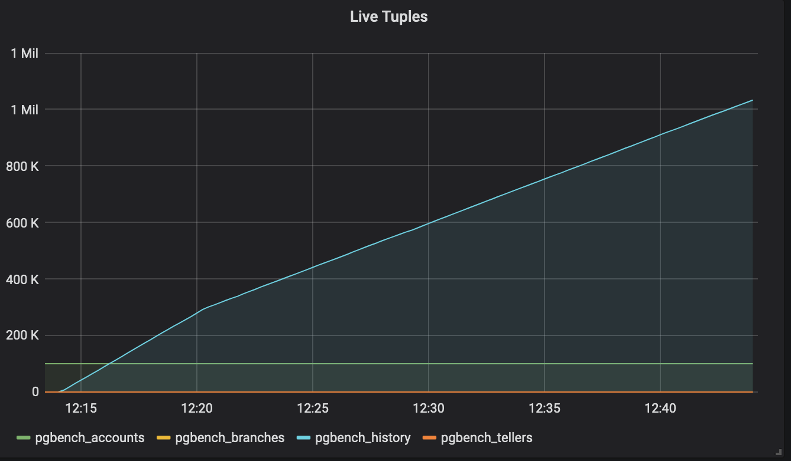{:height="50%" width="50%"}
### Dead Tuples
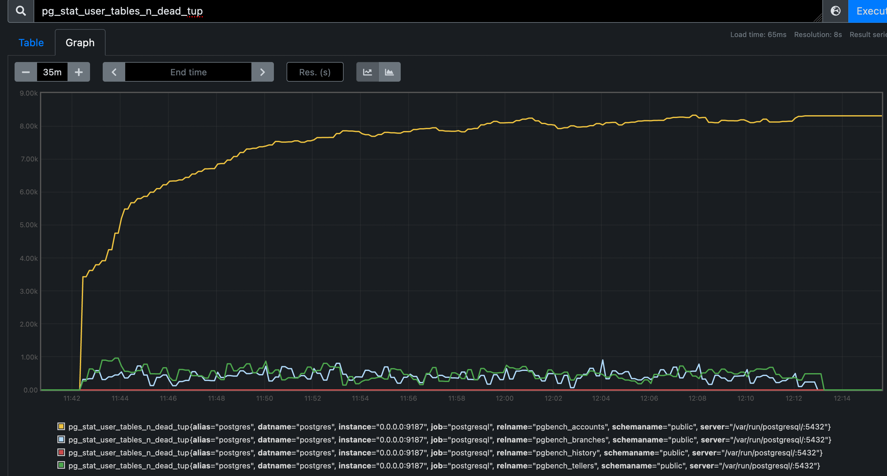{:height="50%" width="50%"}
### Autovacuum Count
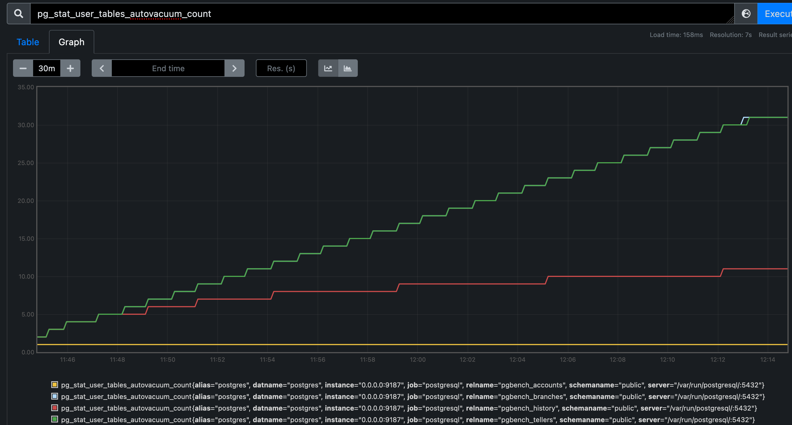{:height="50%" width="50%"}
### Database Size
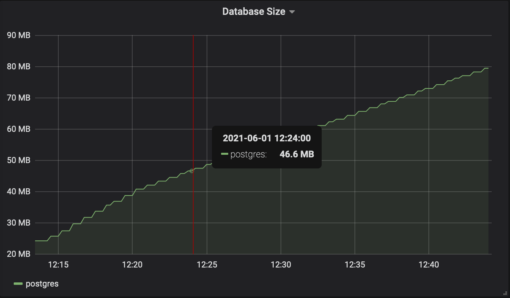{:height="50%" width="50%"}
### Change Stats
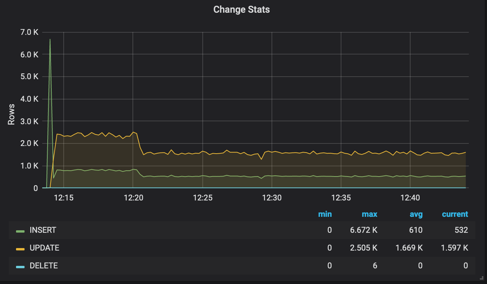{:height="50%" width="50%"}

## Summary

## Second Run - Recommended (From Amazon Articles)
- `autovacuum_naptime = 30`
- `autovacuum_vacuum_scale_factor = 0.1`
- `autovacuum_vacuum_threshold = 50`
- `autovacuum_analyze_scale_factor = 0.1`
- `autovacuum_analyze_threshold = 50`
- `autovacuum_max_workers = 4`

### Transactions
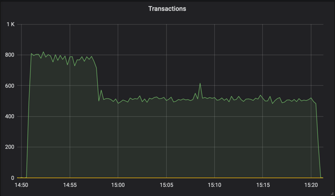
### Live Tuples
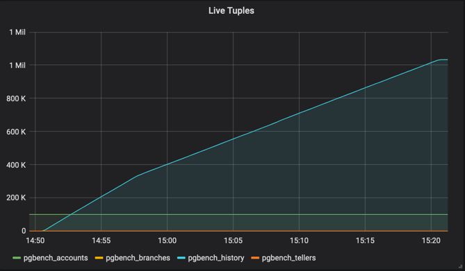
### Dead Tuples
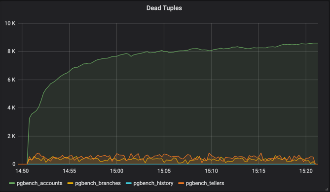
### Autovacuum Count
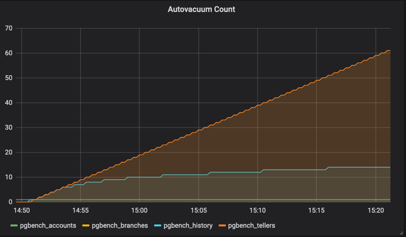
### Database Size
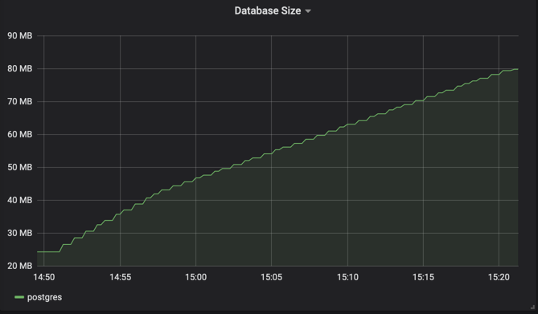
### Change Stats
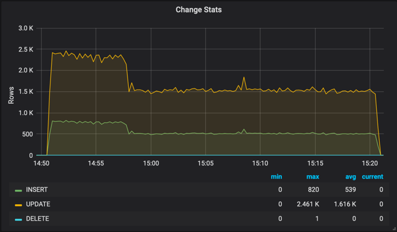

## Summary

## Third Run - Aggressive
- `autovacuum_naptime = 20`
- `autovacuum_vacuum_scale_factor = 0.05`
- `autovacuum_vacuum_threshold = 20`
- `autovacuum_analyze_scale_factor = 0.05`
- `autovacuum_analyze_threshold = 20`
- `autovacuum_max_workers = 8`
- `autovacuum_vacuum_insert_threshold = 500`
- `autovacuum_vacuum_insert_scale_factor = 0.05`

### Transactions
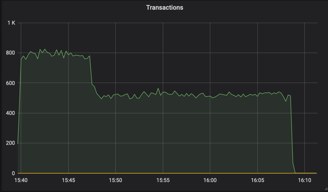
### Live Tuples
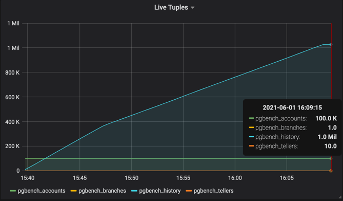
### Dead Tuples
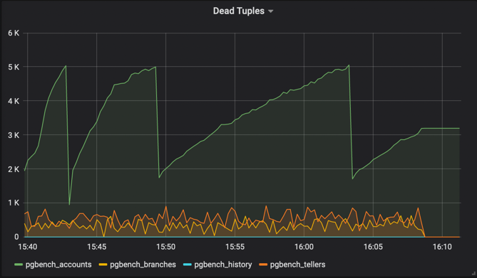
### Autovacuum Count
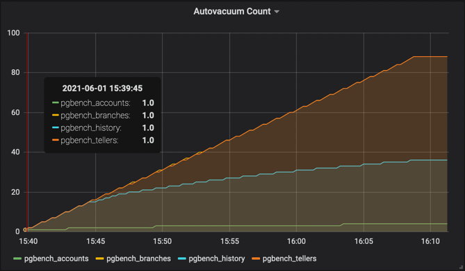
### Database Size
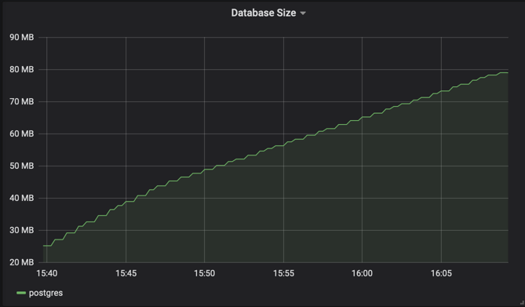
### Change Stats
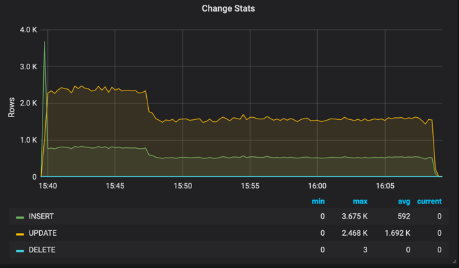

## Summary

## Fourth Run - Disable
- `autovacuum = off`

### Transactions
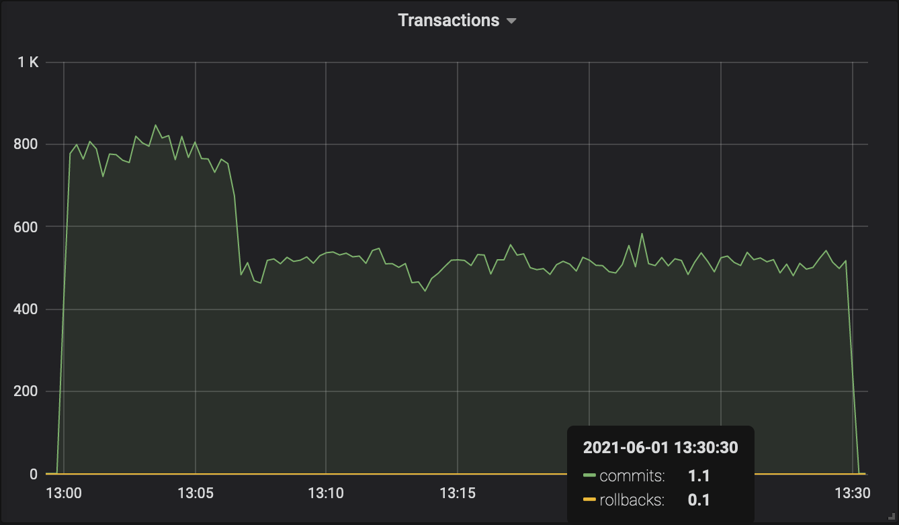
### Live Tuples
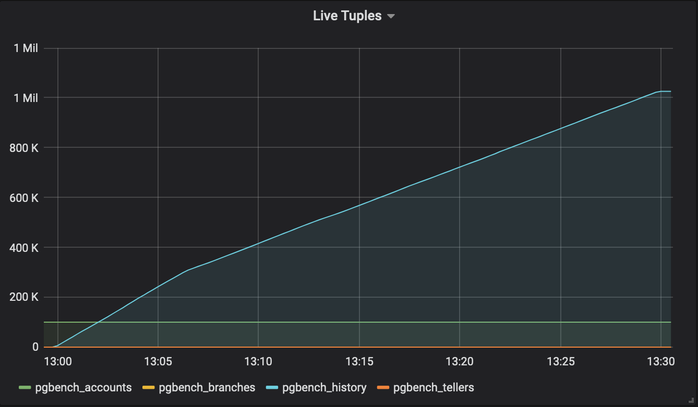
### Dead Tuples
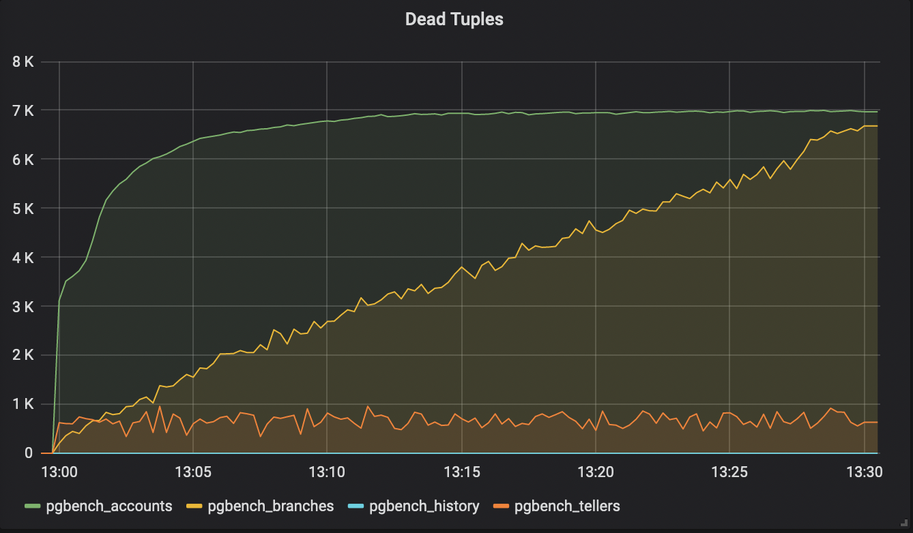
### Autovacuum Count
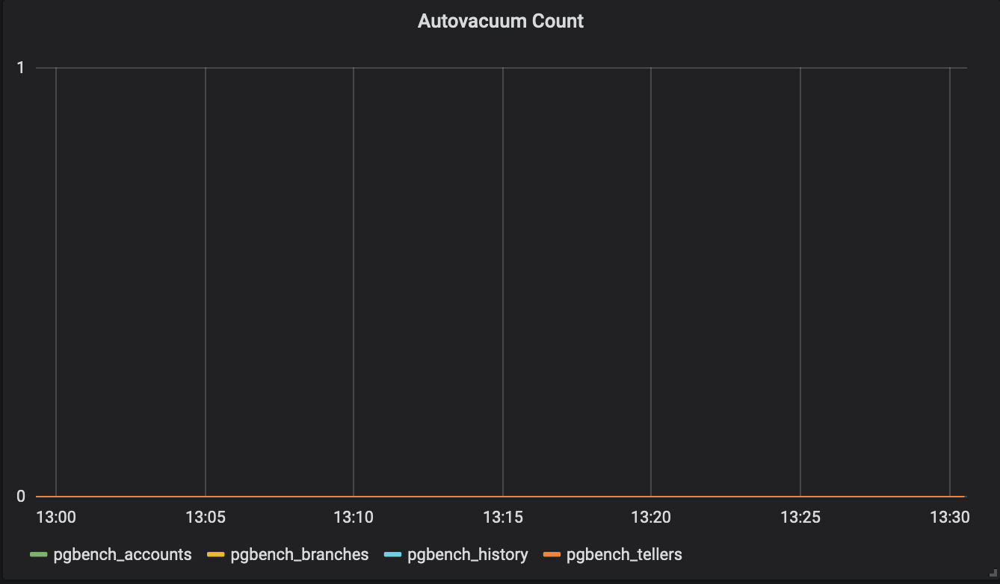
### Database Size

### Change Stats

## Summary