# Sixth Homework - Vacuum Tuning

## Testing Profile

### Execution Command

    pgbench -c 8 -P 60 -T 1800 -U postgres postgres

- 8 клиентов
- отчет через каждые 60 секунд
- длительность 1800 секунд (30 минут)

### Initial Number Of Rows

|table                   | of rows
|------------------------|---------
|pgbench_branches        |1
|pgbench_tellers         |10
|pgbench_accounts        |100000
|pgbench_history         |0

### Executed Requests

```sql
    BEGIN;

    UPDATE pgbench_accounts SET abalance = abalance + :delta WHERE aid = :aid;

    SELECT abalance FROM pgbench_accounts WHERE aid = :aid;

    UPDATE pgbench_tellers SET tbalance = tbalance + :delta WHERE tid = :tid;

    UPDATE pgbench_branches SET bbalance = bbalance + :delta WHERE bid = :bid;

    INSERT INTO pgbench_history (tid, bid, aid, delta, mtime) VALUES (:tid, :bid, :aid, :delta, CURRENT_TIMESTAMP);

    END;
```

### Initial Database Size

|main   |   fsm   |   vm   |  index  | total
|-------|---------|--------|---------|-------
|17 MB  | 1080 kB | 360 kB | 5712 kB | 25 MB

|pgbench_accounts|
|----------------|
|13 MB           |

## First Run - Baseline (Default Parameters)

### Changed Configuration Params
- `autovacuum_naptime = 1min`
- `autovacuum_vacuum_scale_factor = 0.2`
- `autovacuum_vacuum_threshold = 50`
- `autovacuum_analyze_scale_factor = 0.1`
- `autovacuum_analyze_threshold = 50`
- `autovacuum_max_workers = 3`

### Transactions
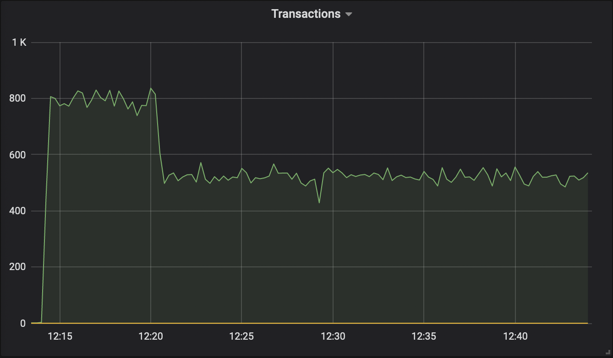

### Live Tuples
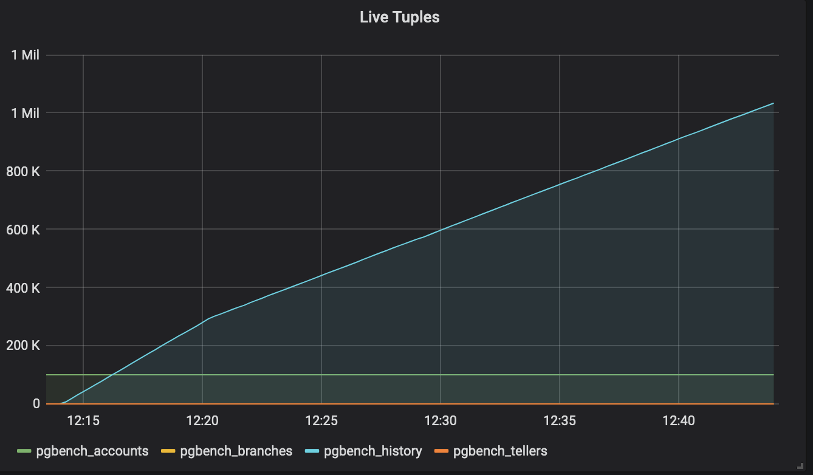

### Dead Tuples
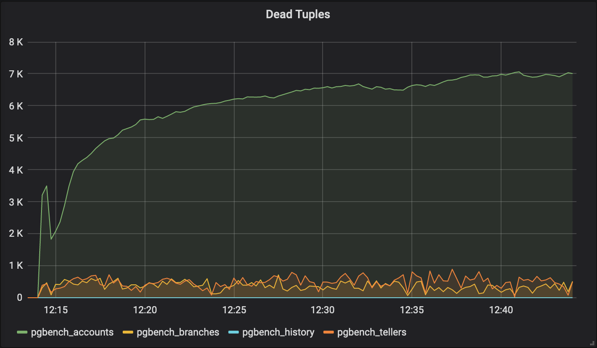

### Autovacuum Count
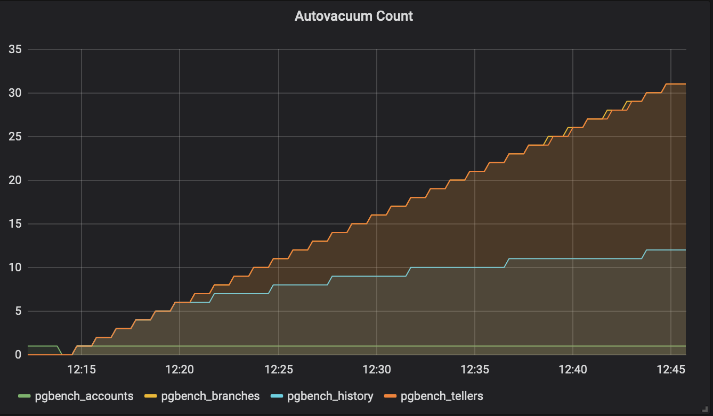

### Database Size
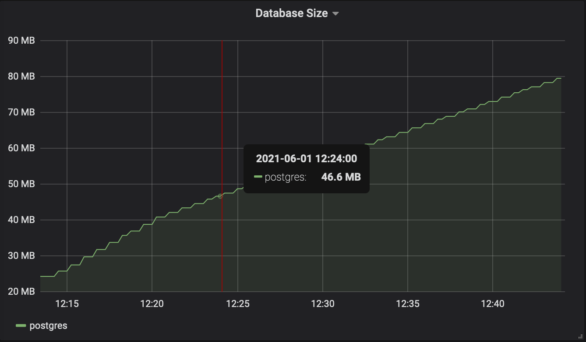

### Change Stats
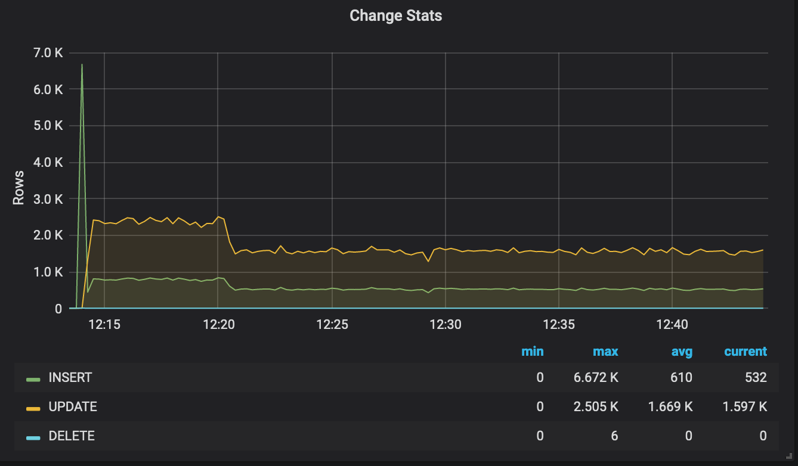

### Summary
Number of transactions actually processed: 1037777
- Транзакции упали с 800 до 500 через 5-ть минут
- Dead Tuples у `pgbench_accounts` не удалялись ни разу, у остальных (`pgbench_tellers` и `pgbench_tellers`) удалялись раз в минуту
- `n_dead_tup > (reltuples * autovacuum_vacuum_scale_factor) + autovacuum_vacuum_threshold`
- для `pgbench_accounts` ~8000 > (100000 * 0.2) + 50, ~8000 > 20050
- база выросла в размере до 80МБ

## Second Run - Recommended (From Amazon Articles)

### Changed Configuration Params
- `autovacuum_naptime = 30`
- `autovacuum_vacuum_scale_factor = 0.1`
- `autovacuum_vacuum_threshold = 50`
- `autovacuum_analyze_scale_factor = 0.1`
- `autovacuum_analyze_threshold = 50`
- `autovacuum_max_workers = 4`

### Transactions
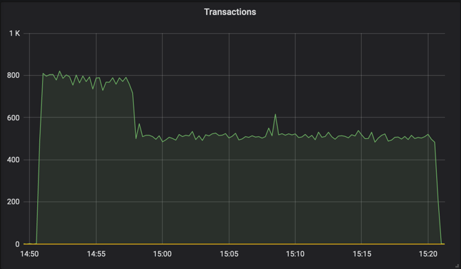

### Live Tuples
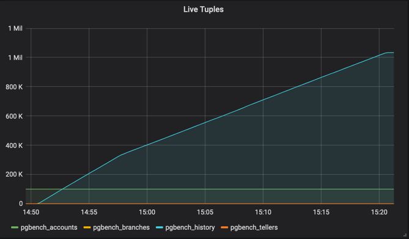

### Dead Tuples
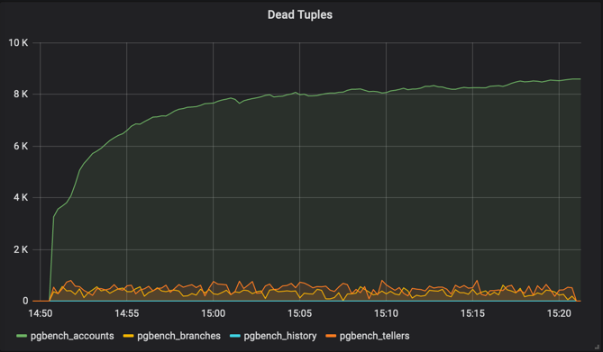

### Autovacuum Count
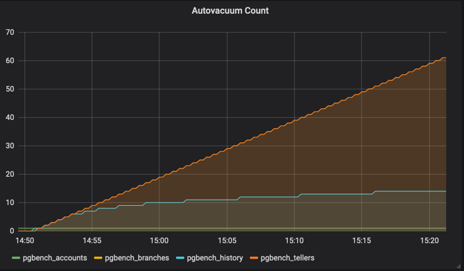

### Database Size
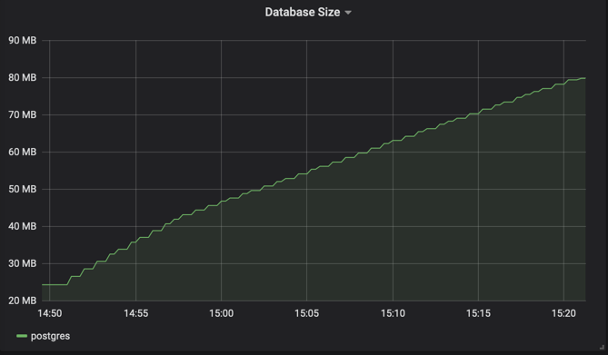

### Change Stats
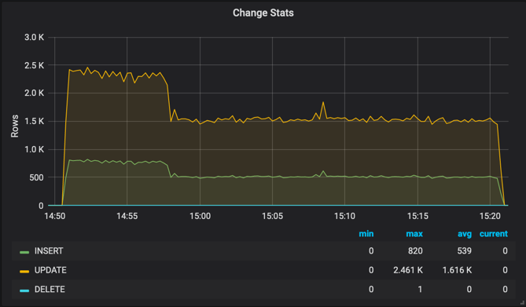

### Summary
Number of transactions actually processed: 1025812
- Транзакции без изменений
- Заметно, что autovacuum выполнялся чаще, что впрочем ни на что не повлияло


## Third Run - Aggressive

### Changed Configuration Params
- `autovacuum_naptime = 20`
- `autovacuum_vacuum_scale_factor = 0.05`
- `autovacuum_vacuum_threshold = 20`
- `autovacuum_analyze_scale_factor = 0.05`
- `autovacuum_analyze_threshold = 20`
- `autovacuum_max_workers = 8`
- `autovacuum_vacuum_insert_threshold = 500`
- `autovacuum_vacuum_insert_scale_factor = 0.05`

### Transactions
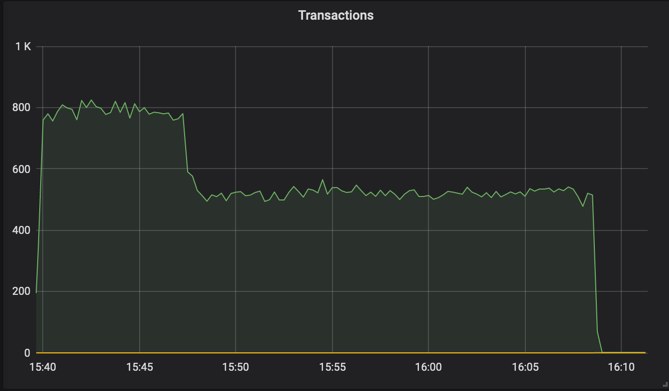

### Live Tuples
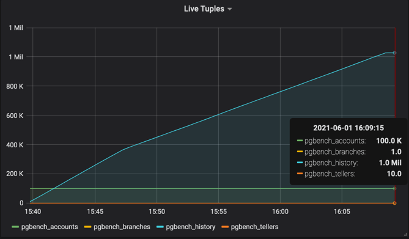

### Dead Tuples
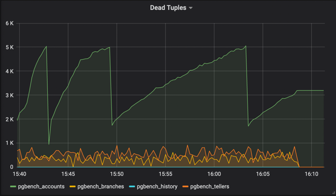

### Autovacuum Count
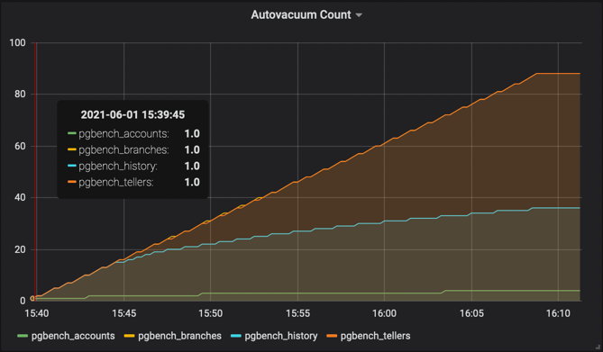

### Database Size
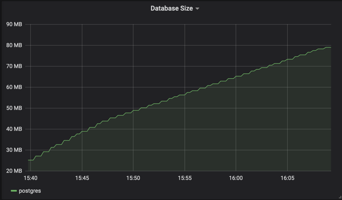

### Change Stats
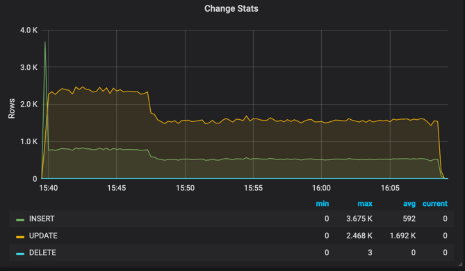

### Summary
Number of transactions actually processed: 1033838
- Транзакции без изменений
- Трижды отработал autovacuum для `pgbench_accounts` (а ожидалось только один раз)
- `n_dead_tup > (reltuples * autovacuum_vacuum_scale_factor) + autovacuum_vacuum_threshold`
- для `pgbench_accounts` ~8000 > (100000 * 0.05) + 20, ~8000 > 5020

## Fourth Run - Disabled Autovacuum

### Changed Configuration Params
- `autovacuum = off`

### Transactions
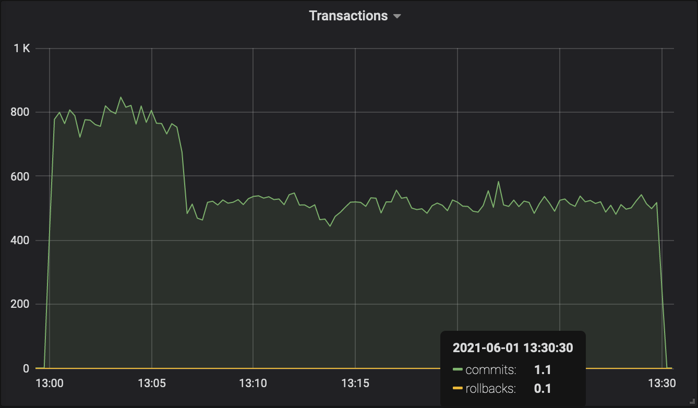

### Live Tuples
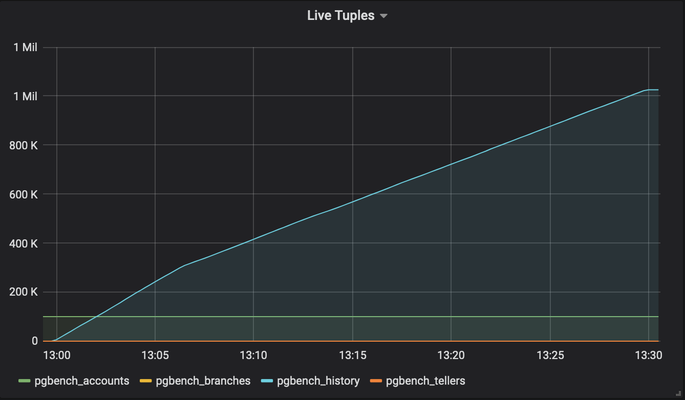

### Dead Tuples
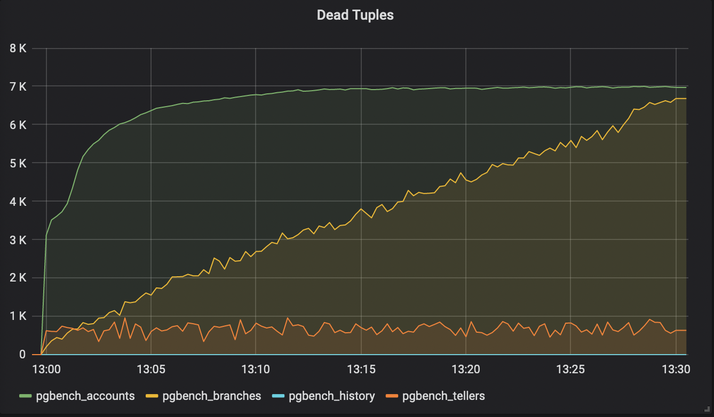

### Autovacuum Count
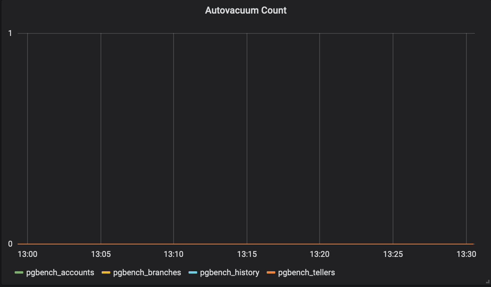

### Database Size
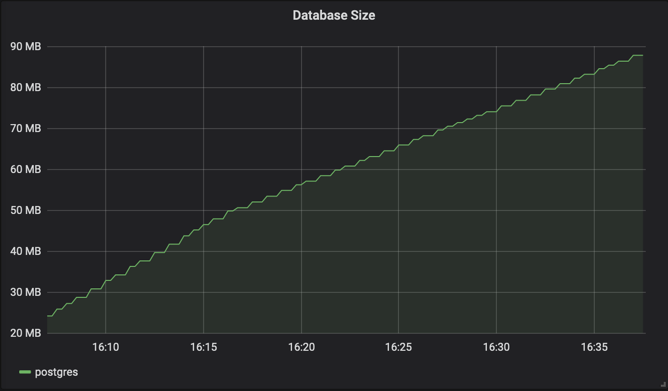

### Change Stats
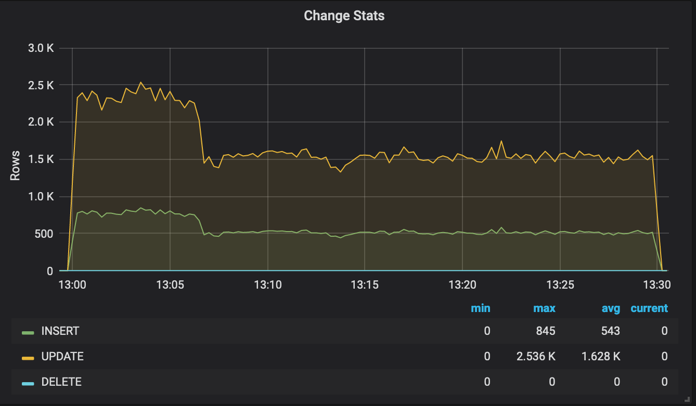

### Summary
Number of transactions actually processed: 1100224
- Dead tuples у `pgbench_accounts` примерно через 10-ть минут перестали расти 
- Dead tuples у `pgbench_branches` росли на протяжении всего теста
- Размер базы вырос до 85МБ

```sql
SELECT pg_size_pretty(sum(pg_relation_size(relid,'main'))) AS main,
    pg_size_pretty(sum(pg_relation_size(relid,'fsm'))) AS fsm,
    pg_size_pretty(sum(pg_relation_size(relid,'vm'))) AS vm,
    pg_size_pretty(sum(pg_indexes_size(relid))) AS index,
    pg_size_pretty(sum(pg_total_relation_size(relid))) AS total
FROM pg_stat_all_tables;
```

|main  |   fsm   |   vm   |  index  | total
|------|---------|--------|---------|-------
|77 MB | 1112 kB | 360 kB | 5760 kB | 85 MB

    postgres=# SELECT name, setting FROM pg_settings WHERE name='autovacuum';

|name       | setting
|-----------|---------
|autovacuum | off


    postgres=#  SELECT schemaname, relname, n_live_tup, n_dead_tup FROM pg_stat_user_tables WHERE relname='pgbench_accounts' ORDER BY n_dead_tup;

|schemaname |     relname      | n_live_tup | n_dead_tup
|-----------|------------------|------------|------------
|public     | pgbench_accounts |     100000 |       7021

|schemaname |     relname      | n_live_tup | n_dead_tup
|-----------|------------------|------------|------------
|public     | pgbench_branches |          1 |       7045


    postgres=# SELECT relname, last_vacuum, last_autovacuum FROM pg_stat_user_tables;

|relname          |          last_vacuum          | last_autovacuum
|-----------------|-------------------------------|-----------------
|pgbench_accounts | 2021-06-02 13:04:16.273836+00 |
|pgbench_history  | 2021-06-02 13:04:16.336987+00 |
|pgbench_tellers  | 2021-06-02 13:06:58.503286+00 |
|pgbench_branches | 2021-06-02 13:06:58.502698+00 |